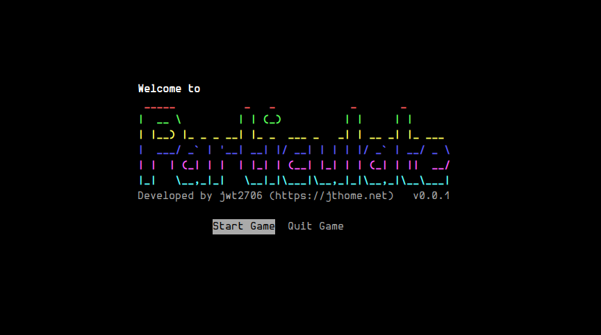
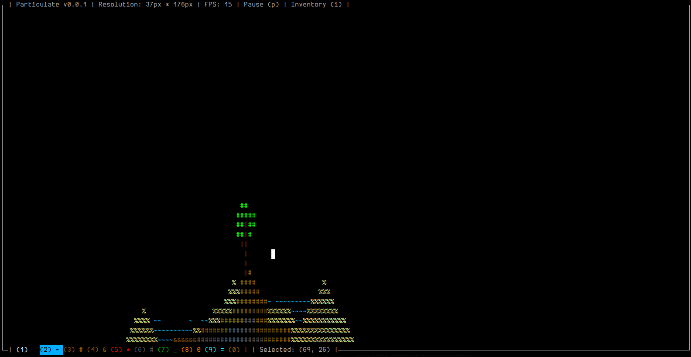
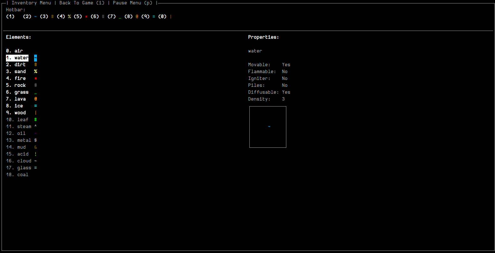

# Particulate

<pre align="center">
 ____            _   _            _       _       
|  _ \ __ _ _ __| |_(_) ___ _   _| | __ _| |_ ___ 
| |_) / _` | '__| __| |/ __| | | | |/ _` | __/ _ \
|  __/ (_| | |  | |_| | (__| |_| | | (_| | ||  __/
|_|   \__,_|_|   \__|_|\___|\__,_|_|\__,_|\__\___|
A Powder Game, in the Terminal
</pre>

Particulate is a particle sandbox game that lets you spawn various elements into a miniature ASCII world right in your terminal. Watch them interact dynamically, even as you resize the window!

## Play
Supported Plarforms: **Linux, MacOS**<br />
Windows support coming soon<sup>TM</sup>

### Setup
1. Download the latest build from [here](https://github.com/jwt2706/Particulate/releases/latest) for your respective OS.
2. Extract the folder.
3. Open a terminal in the location you downloaded Particulate.
4. Make the binary executable (if needed):
    ```
    chmod +x particulate
    ```
5. Start the game:
    ```
    ./particulate
    ```
Have fun! :D

## Screenshots
<div align="center">
    
    
    
</div>

## Development Setup
1. Install ncurses for your respective os (windows doesn't support ncurses boooo)
2. Clone the repo
3. Run make
